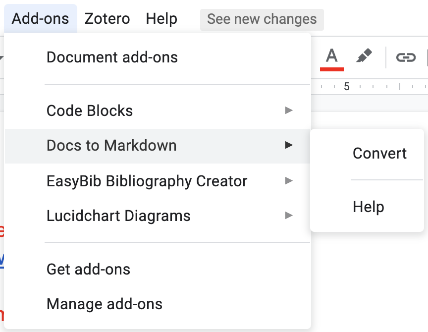

# Creating Specs/Reports for W3C CCG Work Items

This page provides instructions for creating specs or reports for your CCG work item. The W3C has a small set of requirements for [how community groups publish their reports](https://www.w3.org/community/reports/reqs/), which these methods help you comply with. 

At the core, [ReSpec](https://github.com/w3c/respec/wiki) widely used for generating W3C specs/reports with consistent structure (and look and feel). And while you don't have to use ReSpec (or the methods listed below), these make it much easier to comply with [W3C's community report requirements](https://www.w3.org/community/reports/reqs/), which are critical for patent licensing commitments (among other things).

At the same time, some CCG members find working with ReSpec -- which is HTML with the ReSpec js script -- a little difficult or tedious. For that reason, there are other tools to help with either the initial creation or ongoing conversion. This describes the options, how to pick one, and instructions for getting started with each.

## Quick Start
If you already know what tool/method you want to use to write your specs/reports, get started:
- [Respec](#respec) - editing HTML docs
- [Markdown converted to HTML](#markdown-conversion) - editing markdown docs that get auto-converted to HTML 
- [Other methods](#other)

## TL;DR: What Method Should I Use?

- Use [Respec](#respec):
   - For more technical or advanced specifications
   - If close change tracking on the final html output is critical
- Use [Automatic Markdown Conversion](#markdown-conversion):
   - For a quick way to get started with your spec
   - For community notes, commentary, and earlier stages of community specifications.
   - Other notes:
     - You can always switch to direct use of respec over time
     - If you already have a document (like a google doc), you can use a tool to convert to markdown to get started
- Other tools supporting conversion from doc formats
   - These can be useful for getting started from an existing google doc
   - These are not recommended for ongoing conversion because they make change tracking very difficult
   
For additional rationale behind the above guidance, see [Recommendation Details](#recommendation-details).

## Get started

### Respec 

- [Tutorial Video](https://youtu.be/0eQXU6Z-A6Q), divided into four primary parts (there is a time index at the beginning of the video):
  1. Tutorial on setting up a new github repository for ccg work (about 10 minutes)
  2. Setting up a new ReSpec-enabled document (~ 10 minutes)
  3. Tutorial on the basics of github branch-edit-commit-publish-pull_request cycle (~ 15 minutes)
  4. Q&A (~15 minutes)
- [Respec Documentation](https://respec.org/docs/)

### Markdown Conversion

There are 2 methods to accomplish this. Both allow you to edit markdown files and have the html/ReSpec generated for you on commit. You can also use the toolset on your local machine to preview the html conversion, but the automatic conversion makes it easier for the broadest set of contributors.

#### Spec-Prod

[Spec-Prod](https://github.com/w3c/spec-prod) is a W3C-provided tool that converts the bikeshed (extension of markdown files -- uses .bs file extension) file to html. 

##### Get Started
To get started, use the [markdown-to-spec](https://github.com/w3c-ccg/markdown-to-spec) template repo. Follow the simple [README steps](https://github.com/w3c-ccg/markdown-to-spec/README.md)

##### Additional Information

To see an example repo that uses it, look at [vc-ed-models spec](https://w3c-ccg.github.io/vc-ed-models/) and [source](https://github.com/w3c-ccg/vc-ed-models). Note the following:
- The "source" file for the html is index.bs, in the main branch
- The [github action](https://github.com/w3c-ccg/vc-ed-models/blob/main/.github/workflows/publish.yml) converts that file to index.html and pushes it to the gh-pages branch

You can also run bikeshed on your local machine to preview the conversion. [See instructions for running bikeshed locally](https://w3c-ccg.github.io/bikeshed_instructions.html).

#### ReSpec Github Pages

[ReSpec github pages](https://github.com/transmute-industries/respec-github-pages) also allows you to:
- edit in markdown
- create a repo from a template repo

It uses Github Pages site generation to convert to the ReSpec html.

### Other

If you already have a google doc, you can convert it to markdown or respec (and subsequently use the above methods).

#### Docs to Markdown 

Docs to Markdown is a google doc addon that will convert to markdown for you. You'll most likely need to cleanup the markdown output, but it's a convenient way to get started. 

To use:
- Install the Docs to Markdown Add-on in the google document
- Select "Convert" from the Add-on menu (see screenshot below)

#### Doc 2 ReSpec Tool (Beta)
This is beta and not known to be tested in the CCG, but feel free to try it out: 
- [Description from mailing list](https://lists.w3.org/Archives/Public/spec-prod/2018JulSep/0003.html)
- [Sandbox demo](credweb.org/signals)

## Recommendation Details

| Tool Type | Required knowledge | Advantages            | Disadvantages | 
|-----------|--------------------|-----------------------|---------------|
| Respec    | HTML               | Close change tracking | May be difficult for non-technical users |
| Ongoing conversion from Markdown | Markdown | Ease of use   | Moderate change tracking  |
| Conversion from doc | --        | Initial ease of use   | Output more difficult to understand; not recommended for use with ongoing conversions | 
   
Note that a big distinguishing characteristic is the ability to perform change tracking on the generated (html) document. This is essential for very detailed and/or technical specs with a lot of changes (for example the VC and DID specs) -- both for contributor tracking and for compliance with patent licensing commitments.

Ongoing conversion from markdown may be a sweetspot for either less technical reports or ones that are not moving to a working group (for example, community group notes and other reports). With github commit actions, it's possible to run conversion tools on commit, so that all you have to worry about is editing markdown files. Change tracking on the markdown file is easy, but may be a little more difficult on the .html file. At the same time, it's possible to use such conversion tools for a while and switch to using respec directly as a work item gets more mature.

The last category, involving use of tools that convert from .doc formats to .html are appealing but largely experimental. For that reason, this path is largely untested.
